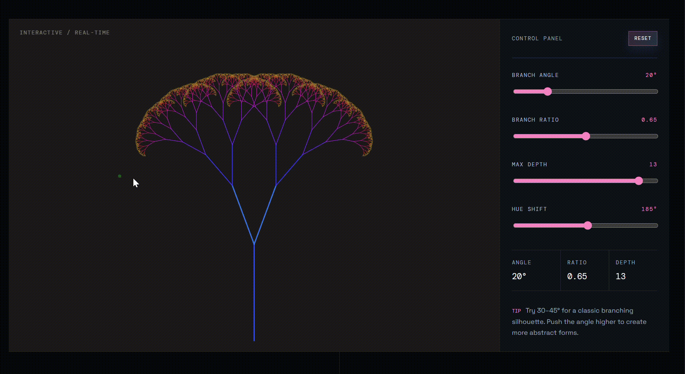

# Recursive Tree

An interactive **p5.js generative-art experiment** exploring recursion through a continuously evolving tree.

The tree is generated by a recursive branching algorithm, with its structure changing in real time based on user-controlled parameters.

## 🎥 Live Demo



## ✨ Features

* 🌿 Real-time recursive tree generation
* 🎛️ Adjustable **branch angle**
* 📏 Adjustable **branch ratio**
* 🧬 Adjustable **recursion depth**
* 🎨 Interactive hue control
* 🖱️ Mouse / touch interaction
* 🔄 Reset controls
* 📱 Responsive single-page experience


### Core idea

```text
Branch
  ↓
Create smaller branches
  ↓
Rotate left + right
  ↓
Reduce branch length
  ↓
Repeat
```

## 🛠️ Built With

`p5.js` · `JavaScript` · `HTML` · `CSS`

## 🎨 Interaction

Move your cursor across the canvas or use the controls to experiment with the tree.

Try changing:

* **Angle** → changes the shape of the tree
* **Ratio** → controls how quickly branches shrink
* **Depth** → controls the level of recursion
* **Hue** → changes the visual appearance

## 🌱 What I Explored

* Recursive functions
* Procedural generation
* Generative art
* Interactive parameters
* Coordinate transformations
* Real-time canvas rendering

## 💡 Concept

This project explores how a simple recursive rule can produce increasingly complex structures.

> **Simple rules → repeated recursion → complex forms**

## 👤 About

**Krishna Patel**

---

